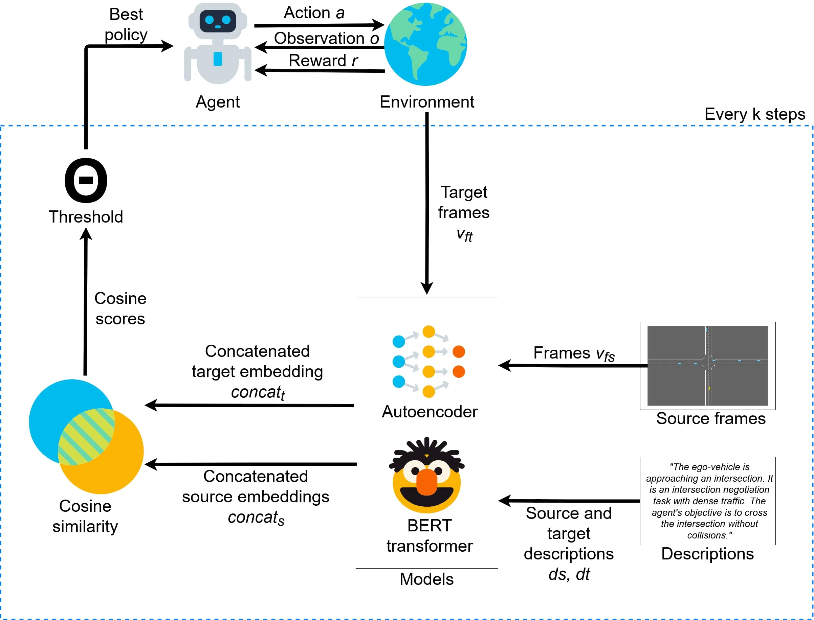

<div align="center">
  <h1 align="center">FAST – Framework for Adaptive Similarity-based Transfer</h1>
</div>

This is the implementation of the paper titled: ["FAST: Similarity-based Knowledge Transfer for Efficient Policy Learning"]() accepted by IEEE Conference on Games (CoG) 2025.

---

# Table of Contents
- [About](#about)
- [Repository Structure](#repository-structure)
- [Getting start](#getting-start)
- [Usage](#usage)
- [Changes](#changes-in-highwayenv-and-stable-baselines3)

---

# About
FAST – Framework for Adaptive Similarity-based Transfer, leverages visual frames and textual descriptions to create a latent representation of tasks dynamics, that is exploited to estimate similarity between environments. The similarity scores guides our method in choosing candidate policies from which transfer abilities to simplify learning of novel tasks.

 <p align="center">
  <br />
  <em>Illustration of the implementation of the FAST framework used in this work. Given a set of pre-trained policies the agent exploit these policies to learn a new complex task.</em>
</p>

---

# Repository Structure

## Key Directories and Files
- **`ae/imageAE/`**: Contains scripts for autoencoder-based models and utilities.
  - `highway_model.py`: Implements the highway autoencoder model.
  - `kfoldTrainer.py`: Handles k-fold training for the autoencoder.
  - `tune_model.py`: Hyperparameter tuning for the autoencoder.
- **`highway-env/`**: Scripts for creating and extracting datasets for highway environments.
  - `create_dataset.py`: Generates datasets for training.
  - `extract_images_dataset.py`: Extracts image datasets for analysis.
- **`transfer_learning/`**: Scripts for transfer learning and evaluation.
  - `transfer.py`: Implements the transfer learning process.
  - `evaluate.py`: Evaluates the performance of the transfer learning models.
  - `tune_sac.py`: Tunes Soft Actor-Critic (SAC) models.

---

# Getting start

1. Clone the repository
   ```bash
   git clone https://github.com/your-username/FAST.git
   cd FAST
   ```

2. Clone and install the custom version of HighwayEnv and stable-baselines3
    ```bash
    git clone git@github.com:Jek9884/HighwayEnv.git
    git clone git@github.com:Jek9884/stable-baselines3.git
    pip install -e ./HighwayEnv -e ./stable-baslines3
    ```

3. Follow the installation [guide](https://pytorch.org/get-started/locally/) to install the Torch library.

4. Install the required dependencies:
    ```bash
    pip install -r requirements.txt
    ```

# Usage
To train the highway autoencoder, run:
   ```bash
   python tune_model.py
   ```

To save an highway autoencoder, run:
   ```bash
   python save_model.py
   ```

To create a dataset for the highway environment, run:
   ```bash
   python create_dataset.py
   ```

To train RL model without transfer learning, use:

   ```bash
   python tune_sac.py
   ```

To train RL model with transfer learning, use:

   ```bash
   python transfer.py
   ```

To tune RL model optimizing both SAC and transfer hyperparameters, use:

   ```bash
   python transfer.py
   ```

N.B. all the scripts require some parameters, please check them using:

   ```bash
   python "SCRIPT_NAME".py -h
   ```

# Changes in HighwayEnv and stable-baselines3
To adapt to our framework we forked and we applied changes to the already modified version of [HighwayEnv](https://github.com/xiaoli98/HighwayEnv) and [stable-baselines3](https://github.com/xiaoli98/stable-baselines3).

## Highway-env
We added an environment: racetrack-complex-v0. Additionally we changed the reward function for racetrack-v0 and racetrack-complex-v0 to fix a bug.

### racetrack-complex-v0
 <p align="center">
  <br />
</p>

## stable-baselines3
We modified stable-baselines3's SAC algorithm to adapt it to perform the designed transfer learning pipeline.

